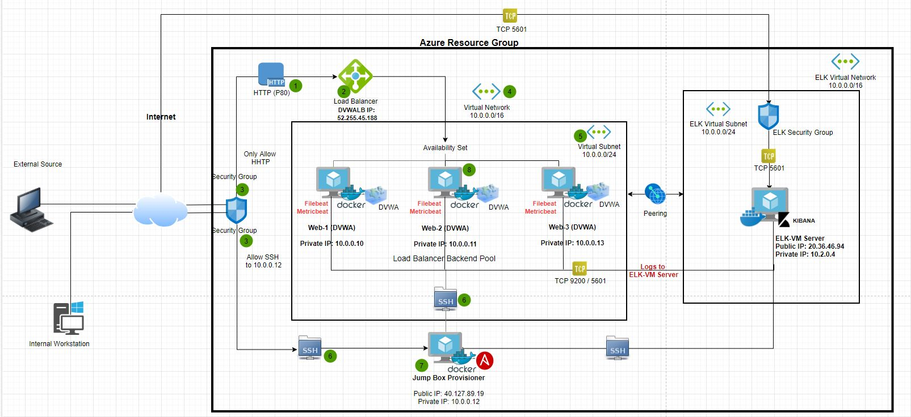
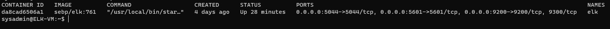

# elkstackproject
- ELK Stack Kibana

## Automated ELK Stack Deployment

The files in this repository were used to configure the network depicted below.

These files have been tested and used to generate a live ELK deployment on Azure. They can be used to either recreate the entire deployment pictured above. Alternatively, select portions of the ansible playbook and config file may be used to install only certain pieces of it, such as Filebeat.

- Ansible/dvwa-playbook.yml
- Ansible/hosts.txt
- Ansible/ansible_config.txt
- Ansible/elk.yml
- Ansible/filebeat-playbook.yml
- Ansible/filebeat-config.txt
- Ansible/metricbeat-playbook.yml
- Ansible/metricbeat-config.txt

This document contains the following details:
- Description of the Topology
- Access Policies
- ELK Configuration
  - Beats in Use
  - Machines Being Monitored
- How to Use the Ansible Build

### Description of the Topology

The main purpose of this network is to expose a load-balanced and monitored instance of DVWA, the D*mn Vulnerable Web Application.

Load balancing ensures that the application will be highly available, in addition to restricting access to the network.
- What aspect of security do load balancers protect?
  - A load balancer intelligently distributes traffic, also adds additional layers of security to your system without any changes to your application. LB also protects the system from DDoS attacks by shifting attack traffic.
 - What is the advantage of a jump box?
   - The advantage of a jump box is to give access to the user from a single node that can be secured and monitored. The use of a jump box guarantees a single, secure, point of entry to network resources.

Integrating an ELK server allows users to easily monitor the vulnerable VMs for changes to the files and system statistics.
- What does Filebeat watch for? 
  - Filebeat watches for any information in the file system which has been changed and when it has. Filebeat is a lightweight shipper for forwarding and centralizing log data.
- What does Metricbeat record?
    - Metricbeat is a lightweight shipper that you can install on your servers to periodically collect metrics from the operating system and from services running on the server. Metricbeat takes the metrics and statistics that collects and ships them to the output you specify, such as Elasticsearch or Logstash.

The configuration details of each machine may be found below.

| Name     | Function         | IP Address | Operating System |
| -------- | ---------------- | ---------- | ---------------- |
| Jump Box | Gateway          | 10.0.0.12  | Linux            |
| Web-1    | Webserver (DVWA) | 10.0.0.10  | Linux            |
| Web-2    | Webserver (DVWA) | 10.0.0.11  | Linux            |
| Web-3    | Webserver (DVWA) | 10.0.0.13  | Linux            |
| ELK-VM   | Elastic Server   | 10.2.0.4   | Linux            |

### Access Policies

The machines on the internal network are not exposed to the public Internet. 

Only the Jump Box machine can accept connections from the Internet. Access to this machine is only allowed from the following IP addresses:
- [Your Public IP address] e.g [119.18.22.67]

Machines within the network can only be accessed by Jump Box virtual machine.
- The Jump Box VM has access to the Web VM 1/2/3 & ELK VM . The IP address of the Jump Box VM is 10.0.0.12

A summary of the access policies in place can be found in the table below.

| Name     	      | Publicly Accessible | Allowed IP Addresses     		 |
| ------------------- | ------------------- | ---------------------------------- |
| Jump Box 	      | Yes / SSH-22        | 119.18.22.67             		 |
| Web-1    	      | No                  | WEB LB 52.255.45.188, JB 10.0.0.12 |
| Web-2       	      | No                  | WEB LB 52.255.45.188, JB 10.0.0.12 |
| Web-3    	      | No                  | WEB LB 52.255.45.188, JB 10.0.0.12 |
| ELK-VM   	      | Yes / TCP 5601/9200 | 10.0.0.12, 10.0.0.10/11/13	 |
| Load Balancer       | Yes / HTTP 80	    | [Personal IP] 119.18.22.67	 |

### Elk Configuration

Ansible was used to automate configuration of the ELK machine. No configuration was performed manually, which is advantageous because...
- Ansible allows IT administrators to automate their daily tasks and save a lot of time. That frees them to focus on efforts that help deliver more value to the business by spending time on more important tasks.

The playbook implements the following tasks:
- Install Docker
- Install python3-pip
- Install Docker python module
- Set the vm.max_map_count to 262144
- Download and launch a docker elk container

The following screenshot displays the result of running `docker ps` after successfully configuring the ELK instance.

### Target Machines & Beats
This ELK server is configured to monitor the following machines:
- Web-1, 10.0.0.10
- Web-2, 10.0.0.11
- Web-3, 10.0.0.13

We have installed the following Beats on these machines:
- Filebeat
- Metricbeat

These Beats allow us to collect the following information from each machine:
- Filebeat allows us to collect system log events from the host machines
- Metricbeat allows us to collect metrics and system statistics from host machines.

### Using the Playbook
In order to use the playbook, you will need to have an Ansible control node already configured. Assuming you have such a control node provisioned: 

SSH into the control node and follow the steps below:
- Copy the filebeat.cfg file to /etc/ansible/filebeat-config.yml
- Update the file filebeat-config.yml to include 

      output.elasticsearch:
	  hosts: ["10.2.0.4:9200"]
	  username: "elastic"
	  password: "changeme"
	
	  setup.kibana:
	  host: "10.2.0.4:5601"

- Save this file in  /etc/ansible/files/filebeat-config.yml.

- Run the playbook, and navigate to  check that the installation worked as expected.

 Answer the following questions to fill in the blanks:
- Which file is the playbook? Where do you copy it?
   - filebeat-config.yml is the playbook and we copied this to /etc/filebeat/filebeat.yml

- Which file do you update to make Ansible run the playbook on a specific machine? How do I specify which machine to install the ELK server on versus which to install Filebeat on?
   -  Updated the Ansible containter host file etc/ansible/host. 
   -  Added a group called [elk] and specify the Private IP of ELK-VM [10.2.0.4]
	# /etc/ansible/hosts

	 	[webservers]
	 	10.0.0.10 ansible_python_interpreter=/usr/bin/python3
	 	10.0.0.11 ansible_python_interpreter=/usr/bin/python3
	 	10.0.0.13 ansible_python_interpreter=/usr/bin/python3

		[elk]
		10.2.0.4 ansible_python_interpreter=/usr/bin/python3

   - Then I updated filebeat-playbook.yml & metricbeat-playbook.yml header part
		
		 name: installing and launching metricbeat
		 hosts: webservers
	  	 become: yes
  	     tasks:

- Which URL do you navigate to in order to check that the ELK server is running?
  The public IP of ELK stack with allowed port number [20.36.46.94:5601].

_As a **Bonus**, provide the specific commands the user will need to run to download the playbook, update the files, etc._
